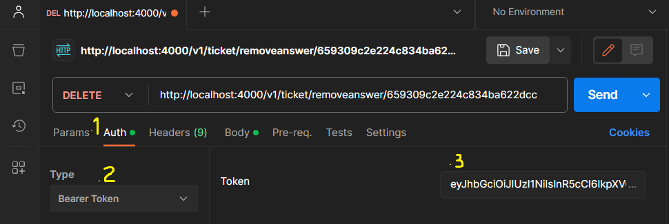
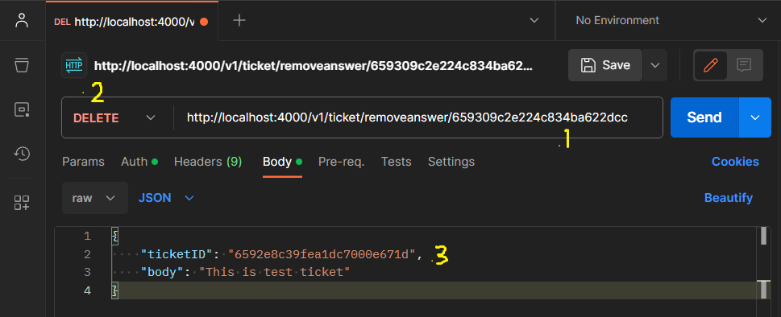
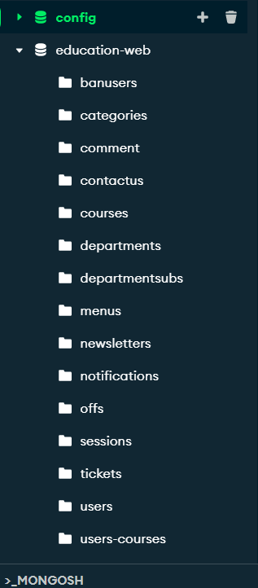

<div align="center">
 
 # Programming Education Website (Back-End)
 #### Educational website full back-end "MVC Architecture" with 👇🏻
 
 <p><a href="https://github.com/ali-script"></a></p>
 
 <p><a href="https://github.com/ali-script"></a></p>
 
 <p><a href="https://github.com/ali-script"></a></p>

---

### You can use this progect to create a website and post educational courses & videos or otherwise in the website 
### This project has not been definitively deployed and is only included in my page for sample work

<div align="left">
 
  ## Dependencies.
  ``` md
 1. install Node-js
 2.   ``    Postman
 3.   ``    Mongodb
 4.   ``    npm
 ```
 ## How to Run?
 ``` md
 1. open terminal/cmd/gitbash in progect route
 2. type "npm i" //if the node_module folder does not exist
 3. type "npm run dev" or "nodemon" to run progect
```
  ## How to send request to APIs ?
  
  <div align="center">
  
### Set your jwt token (It will be sent to you when you register)
    


### Set route and dependencies in postman




##### Data base models & feature 👇🏻



  <details>
<summary><h1>APIs</h1></summary>

``` py


POST   http://localhost:4000/v1/auth/register {UserName, Password, confirmPassword, email, PhoneNum}
POST   http://localhost:4000/v1/auth/login {identifeir , password}
GET    http://localhost:4000/v1/auth/getme  Middlewares: Auth  


POST   http://localhost:4000/v1/categories/set  Middlewares: Auth, Admin {title, href}    
GET    http://localhost:4000/v1/categories/getOne/:id 
GET    http://localhost:4000/v1/categories/getOne/:id 
DELETE http://localhost:4000/v1/categories/removeOne/:id    Middlewares: Auth, Admin


POST   http://localhost:4000/v1/courses/add    Middlewares: Auth, Admin, Multer {title, description, price, href, cover , status, teacher, category, off, keywords} 
PUT    http://localhost:4000/v1/courses/update/:id    Middlewares: Auth, Admin, Multer {title, description, price, href, cover , status, teacher, category, off, keywords} 
DELETE http://localhost:4000/v1/courses/remove/:id  Middlewares: Auth, Admin
GET    http://localhost:4000/v1/courses/getAll/:category
GET    http://localhost:4000/v1/courses/get/:href   Middlewares: Auth 
GET    http://localhost:4000/v1/courses/related/:href   Middlewares: Auth 
GET    http://localhost:4000/v1/courses/popular Middlewares: Auth 
GET    http://localhost:4000/v1/courses/presell Middlewares: Auth 
GET    http://localhost:4000/v1/courses/getAllCourse/:category  Middlewares: Auth 
GET    http://localhost:4000/v1/courses/all Middlewares: Auth 


POST   http://localhost:4000/v1/comments/create Middlewares: Auth  {body, course, :score}
DELETE http://localhost:4000/v1/comments/remove/:id Middlewares: Auth, Admin
PUT    http://localhost:4000/v1/comments/accept/:id Middlewares: Auth, Admin
PUT    http://localhost:4000/v1/comments/reject/:id Middlewares: Auth, Admin
POST   http://localhost:4000/v1/comments/answer/:id Middlewares: Auth, Admin {body}
GET    http://localhost:4000/v1/comments/getAll Middlewares: Auth, Admin


POST   http://localhost:4000/v1/contactus/set   Middlewares: Auth  {body}
GET    http://localhost:4000/v1/contactus/all   Middlewares: Auth, Admin
DELETE http://localhost:4000/v1/contactus/remove/:id    Middlewares: Auth, Admin
POST   http://localhost:4000/v1/contactus/all   Middlewares: Auth, Admin {email, answer}


POST   http://localhost:4000/v1/menu/set    Middlewares: Auth, Admin {title, href}
GET    http://localhost:4000/v1/menu/getall Middlewares: Auth 
POST   http://localhost:4000/v1/menu/setsub/:parentID   Middlewares: Auth, Admin {title, href}
DELETE http://localhost:4000/v1/menu/remove/:id Middlewares: Auth, Admin
DELETE http://localhost:4000/v1/menu/removesub/:id  Middlewares: Auth, Admin


POST   http://localhost:4000/v1/newsletter/create   Middlewares: Auth  {email}
GET    http://localhost:4000/v1/newsletter/getAll   Middlewares: Auth, Admin


POST   http://localhost:4000/v1/notification/send   Middlewares: Auth, Admin {message, adminID}
GET    http://localhost:4000/v1/notification/get    Middlewares: Auth, Admin 
GET    http://localhost:4000/v1/notification/getAll Middlewares: Auth, Admin 


POST   http://localhost:4000/v1/off/create  Middlewares: Auth, Admin {code, percent, course, count}
GET    http://localhost:4000/v1/off/getAll  Middlewares: Auth, Admin
PUT    http://localhost:4000/v1/off/settoall    Middlewares: Auth, Admin {off}
PUT    http://localhost:4000/v1/off/use/:code   Middlewares: Auth, Admin {course}
DELETE http://localhost:4000/v1/off/remove/:code    Middlewares: Auth, Admin 


GET    http://localhost:4000/v1/search/:keyword Middlewares: Auth  


POST   http://localhost:4000/v1/department/add  Middlewares: Auth, Admin {title}
GET    http://localhost:4000/v1/department/getall   Middlewares: Auth 
DELETE http://localhost:4000/v1/department/remove/:id   Middlewares: Auth, Admin 
POST   http://localhost:4000/v1/department/addsub/:parent   Middlewares: Auth, Admin {body}
GET    http://localhost:4000/v1/department/getsubs  Middlewares: Auth 
DELETE http://localhost:4000/v1/department/removesub/:id    Middlewares: Auth, Admin


PUT    http://localhost:4000/v1/users/banUser/:id'  Middlewares: Auth, Admin
GET    http://localhost:4000/v1/users/getall'   Middlewares: Auth, Admin
DELETE http://localhost:4000/v1/users/remove/:id'   Middlewares: Auth, Admin
PUT    http://localhost:4000/v1/users/makeadmin/:id'    Middlewares: Auth, Admin
PUT    http://localhost:4000/v1/users/humiliationToUser/:id'    Middlewares: Auth, Admin
PUT    http://localhost:4000/v1/users/changeInfo'   Middlewares: Auth, Admin {UserName, Password,confirmPassword, email, PhoneNum, }


POST   http://localhost:4000/v1/ticket/create'  Middlewares: Auth  { departmentID, departmentSubID, course, body, priority }
GET    http://localhost:4000/v1/ticket/getall'  Middlewares: Auth, Admin
GET    http://localhost:4000/v1/ticket/myTickets'   Middlewares: Auth  
POST   http://localhost:4000/v1/ticket/answer'  Middlewares: Auth, Admin {body, ticketID}
GET    http://localhost:4000/v1/ticket/:id/answer'  Middlewares: Auth, Admin 
DELETE http://localhost:4000/v1/ticket/remove/:id'  Middlewares: Auth, Admin 
DELETE http://localhost:4000/v1/ticket/removeAnswer/:id'    Middlewares: Auth, Admin 


```
  </details>

####  *all APIs set on localhost:4000 if you want to change the port, just download the progect and change PORT in the .env file

<div align="left">
 
## Abilities 

``` py
1. Send Email To User
2. Hash User Password (no one can see the password)
3. Decode The Password
4. Protection Of All Important APIs
5. Encryption of Database Data
6. Easy And Safe Access To Admin Dashboad (Management dashboard)

```
  <details>
<summary><h3>More Abilities ... </h3></summary>

``` py
1.  Signin
2.  Login
3.  GetUserProfile
4.  ManagementOfCategories
5.  ManagementOfComments
6.  ContactUs
7.  ManagementOfCourses
8.  ManagementOfDepartments
9.  ManagementOfSubDepartments
10. ManagementOfMenu
11. ManagementOfSunMenu
12. JoinToNewsletter
13. ManagementOfNotifications
14. ManagementOfOffOnCourses
15. Search
16. SendTicketToSupport
17. ManagementOfUsers
```
   
 </details>

---
  
<div align="center">

## TECHNOLOGY USED

 [](https://github.com/Ali-Script)
 [](https://github.com/Ali-Script)
 [](https://github.com/Ali-Script)
 [](https://github.com/Ali-Script)
 [](https://github.com/Ali-Script)
 [](https://github.com/Ali-Script)
 [](https://github.com/Ali-Script)


 ## MORE PACKAGE USED
 
 bcrypt : [](https://github.com/Ali-Script)
 body-parser : [](https://github.com/Ali-Script)
 cors : [](https://github.com/Ali-Script)
 dotenv : [](https://github.com/Ali-Script)
 email-validator : [](https://github.com/Ali-Script)
 express : [](https://github.com/Ali-Script)
 fastest-validator : [](https://github.com/Ali-Script)
 jsonwebtoken : [](https://github.com/Ali-Script)
 mongoose : [](https://github.com/Ali-Script)
 morgan : [](https://github.com/Ali-Script)
 multer : [](https://github.com/Ali-Script)
 nodemailer : [](https://github.com/Ali-Script)
 
 nodemon : [](https://github.com/Ali-Script)
